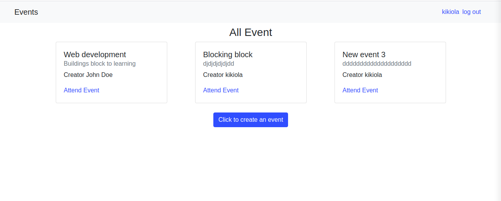

# PRIVATE EVENTS
This is a project based on building associations between a user, the event attended by the user and creating the source and the through table understanding. This project builds showcasing the understanding of user sessions. 
RSpec and Capybara are also implemented for testing both features and models.

## Built With
- Ruby
- Ruby on Rails
- RSpec and Capybara

## Getting Started
To get a local copy up and running follow these simple example steps:
 
### Prerequisite
- Install rails or checkout the <a href="https://guides.rubyonrails.org/getting_started.html">Rails Guide</a> on how to setup the rails environment
- Code editor
- Git and Github

## Usage
- Clone the project to your local machine
- Open your terminal and type the following:
- Run bundle install
- rails db:migrate
- rspec spec/features/authentication_helper.rb (*** for testing ***)

- Open http://localhost:3000/ in your browser

## Authors
- Okikiola Apelehin
- Prajwal Thapa

👤 **Author1**

- Github: [@okikiola11](https://github.com/okikiola11)
- Twitter: [@Kikiolla3](https://twitter.com/Kikiolla3)
- Linkedin: [@okikiola-apelehin](https://www.linkedin.com/in/okikiola-apelehin-459008122/)

👤 **Author2**
- LinkedIn: [Prazwalthapa](www.linkedin.com/in/prazwal-thapa/) 
- GitHub: [@praz99](https://github.com/praz99)
- E-mail: t.prazwal@gmail.com 

## 🤝 Contributing

Contributions, issues and feature requests are welcome!

Feel free to check the [issues page](https://github.com/praz99/private-event/issues).

## Show your support

Give a ⭐️ if you like this project!

## Acknowledgments

- Google

## 📝 License

This project is [MIT](lic.url) licensed.
